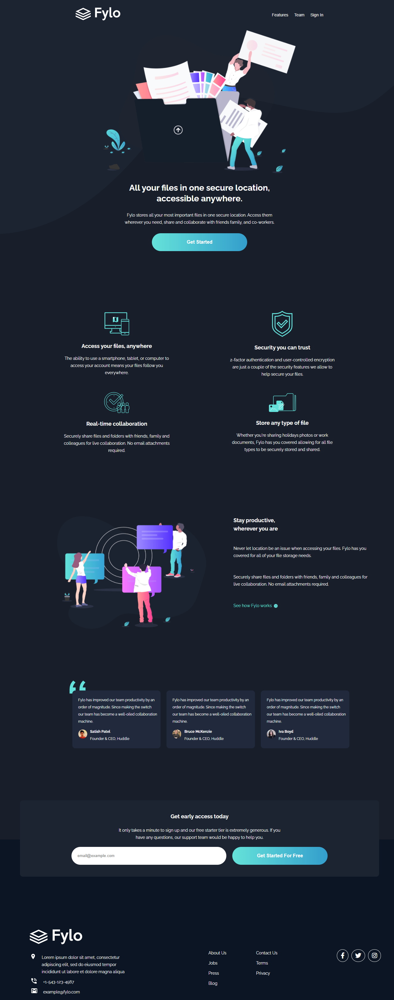

# Frontend Mentor - Fylo dark theme landing page sdjkgnkdsngkfsdgfd changes

This is a solution to the [Fylo dark theme landing page challenge on Frontend Mentor](https://www.frontendmentor.io/challenges/fylo-dark-theme-landing-page-5ca5f2d21e82137ec91a50fd).

## Table of contents

- [Overview](#overview)
  - [The challenge](#the-challenge)
  - [Screenshot](#screenshot)
  - [Links](#links)
- [My process](#my-process)
  - [Built with](#built-with)
  - [What I learned](#what-i-learned)
  - [Useful resources](#useful-resources)
- [Author](#author)

## Overview

### The challenge

Users should be able to:

- View the optimal layout for the site depending on their device's screen size
- See hover states for all interactive elements on the page

### Screenshot

<details>
  <summary>💻 Desktop</summary>
  
</details>

<details>
  <summary>📱 Mobile</summary>
  
</details>

### Links

- Live Site URL: [Fylo dark theme landing page](https://your-live-site-url.com)

## My process

### Built with

- Semantic HTML5 markup
- CSS custom properties
- Flexbox
- CSS Grid
- Mobile-first workflow

### What I learned

I put my knowledge on css flexbox and grid on practice, also learned about custom bullet and how to organize a footer in order to make it look like a different design whent it's adapted to mobile and desktop.

```html
<div class="footer__location">
  <ul>
    <li>
      <div class="mr20">
        Lorem ipsum dolor sit amet, consectetur adipiscing elit, sed do eiusmod tempor incididunt ut labore et dolore magna aliqua
      </div>
    </li>
    <li>+1-543-123-4567</li>
    <li>example@fylo.com</li>
  </ul>
</div>
```
```css
.footer__location ul > li:before {
  content: '';
  height: 20px;
  width: 20px;
  display: block;
  float: left;
  margin-left: -1.5rem;
}
```

### Useful resources

- [Custom bullet list](https://codepen.io/mihai-peteu/pen/jOPObzz) - Used this code as reference

## Author

- Frontend Mentor - [@themattfire](https://www.frontendmentor.io/profile/themattfire)
- Github - [@themattfire](github.com/themattfire)
